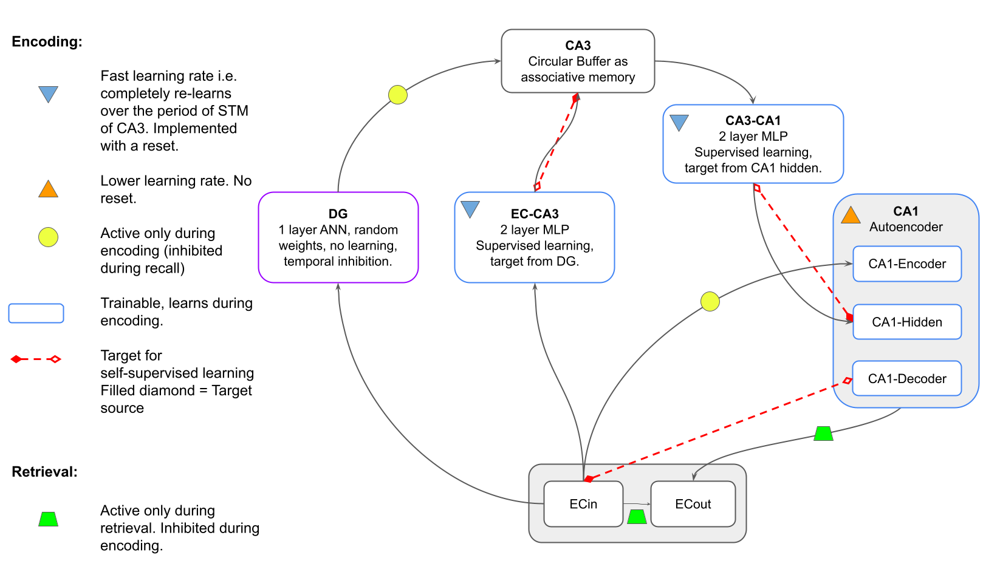

# AHA in PyTorch

This is a PyTorch implementation of AHA and associated learning experiments.
The first version used in [1,2,3], is implemented with Tensorflow and can be found at [AHA Tensorflow codebase](https://github.com/Cerenaut/aha).

AHA is a computational model of the hippocampus based on the CLS framework. 
In contrast to traditional CLS models, which use Hebbian learning in EC->CA3, AHA has self-supervised learning as described by [6]. In addition, it operates on images as opposed to simpler artificial vectors.

For the second set of experiments (See Schapiro experiments below), the implementation of AHA was improved. There is a more sophisticated MSP and EC, more closely matching. 

Additionally, it is possible to use Hebbian leaerning in EC->CA3 to compare to self-supervised learning.

 The system diagram is shown below.

See `/cls_module` for the LTM and STM of CLS. The LTM (long term memory) is in this case a visual component that provides an image embedding.

The STM (short term memory) has two possible implementations. AHA and a simple autoencoder for comparisons.

## Requirements

- PyTorch >= 1.5.1 and < 1.9.0
  - Follow instructions here to set it up locally (depends on your environment)
- [cerenaut-pt-core](https://github.com/Cerenaut/cerenaut-pt-core) - Cerenaut's PyTorch core codebase

Before you run experiments, you will have to install dependencies listed inside `requirements.txt` inside the `aha/` directory.

You can install the dependencies using `pip install -r requirements.txt`.

## Getting Started

First, you need to setup the CLS module before using it with any of the available frameworks.

1. Change into the `cls_module` directory
2. Execute the `python setup.py develop` command to install the package and its dependencies

## Experiments

There are two sets of experiments:

1. the one-shot generalization experiments by Lake et al. [4], and
2. the study of episodic and statistical learning within the hippocampus by Schapiro et al. [5]

### Lake Benchmark (Omniglot)

This is an implementation of the one-shot generalization benchmark introduced by Lake. The code is available under the directory `aha`.

To run experiments, you will need a valid configuration file. There is an existing configuration file located in `aha/definitions/aha_config.json` with the default configuration.

Run the experiment using `python oneshot_cls.py --config path/to/config.json`

Using the config, you can select the type of Long Term Memory (LTM), currently the choice is between a simple k-sparse autoencoder, beta-variational autoencoder or VGG.
There was a more sophisticated 'visual component' in the Tensorflow implementation.

The first stage in execution is to pre-train the LTM.
If you already have a trained model (in a checkpoint file), you can specify it in the config, and then skip the pre-training.

### Schapiro 2016 CLS Experiments (statistical and episodic learning)

This is an implementation of the experiments described in [5].

To run experiments, you will need a valid configuration file. There is are samples located in `aha/definitions/schapiro`.

As for the Lake experiments, you can select the type of STM (short term memory) and LTM (visual component), and the first stage is to pretrain the LTM. You can specify it in the config, and then skip pre-training.

It is possible to choose from the following parameters:
- the language of the presented images (Latin, N_KO). There are two variants of N_KO, deliberately filtered to select more distinct characters.
- if the train/test characters are from the same writer or a different writer (the later requires better generalization)
- the type of learning in EC->CA3 (error driven or Hebbian)

All of the experiment variants from Schapiro et al 2016 are implemented:

- Pairs structure - episodic
- Pairs structure - statistical
- Associative Inference
- Community Structure

## References

[1] Kowadlo, Gideon et al. “One-shot learning for the long term: consolidation with an artificial hippocampal algorithm.” 2021 International Joint Conference on Neural Networks (IJCNN) (2021): 1-7.

[2] Kowadlo, Gideon et al. “Unsupervised One-shot Learning of Both Specific Instances and Generalised Classes with a Hippocampal Architecture.” ArXiv abs/2010.15999 (2020)

[3] Kowadlo, Gideon et al. “AHA! an 'Artificial Hippocampal Algorithm' for Episodic Machine Learning.” ArXiv abs/1909.10340 (2019)

[4] Lake, Brenden M. et al. “One shot learning of simple visual concepts.” Cognitive Science 33 (2011)

[5] Schapiro, Anna C., et al. "Complementary learning systems within the hippocampus: a neural network modelling approach to reconciling episodic memory with statistical learning." Philosophical Transactions of the Royal Society B: Biological Sciences 372.1711 (2017): 20160049

[6] Rolls, Edmund T. "The mechanisms for pattern completion and pattern separation in the hippocampus." Frontiers in systems neuroscience 7 (2013): 74.
